# Foodi

A Food Delivery app created with the MERN stack

## Links

### Project Demo - https://foodi-client-seven.vercel.app/

### Project Overview Video - https://youtu.be/tkVPpXab15U

## Frontend

The frontend of this project is created with ReactJS.<br />

To start the frontend : <br />

`cd client`<br />

`npm install`<br />

`npm run dev`<br />

Also .env file has to be created. <br />

.env content :

```
VITE_API_KEY= from the firebase
VITE_AUTH_DOMAIN= from the firebase
VITE_PROJECT_ID= from the firebase
VITE_STORAGE_BUCKET= from the firebase
VITE_MESSAGING_SENDER_ID= from the firebase
VITE_APP_ID= from the firebase

VITE_IMGBB_KEY= from the imgbb
```

### Screenshots

#### Home Page :

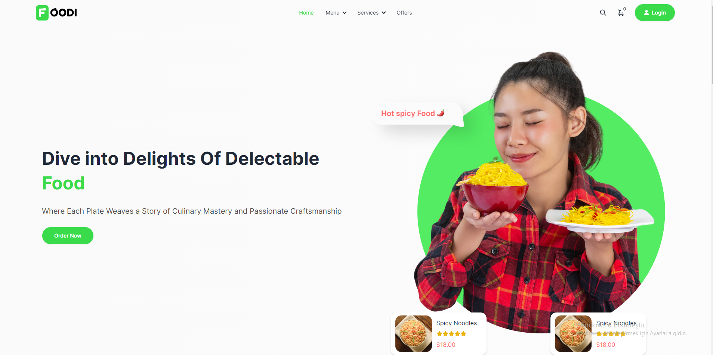
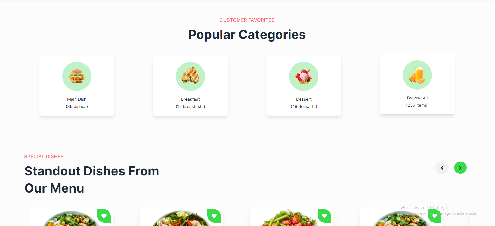
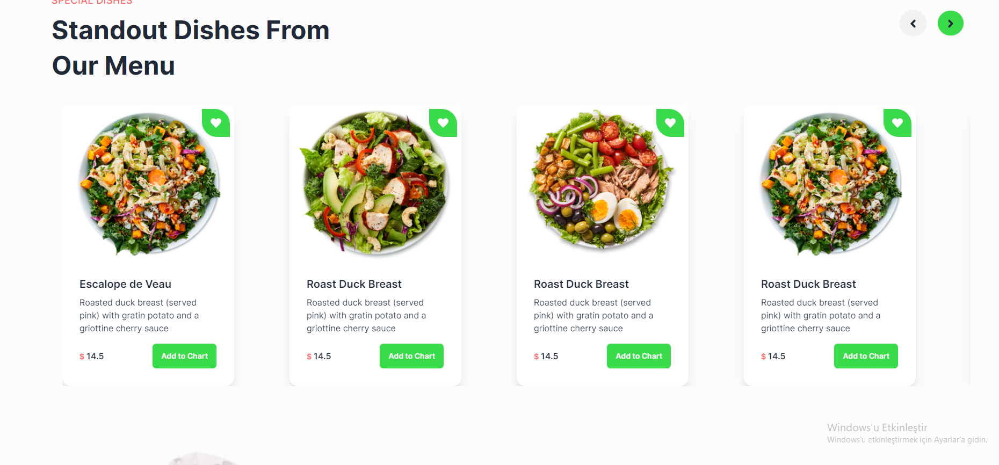
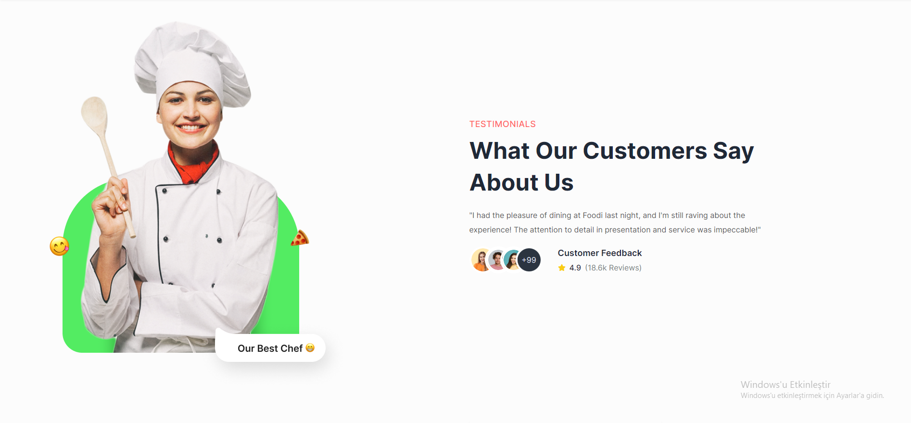
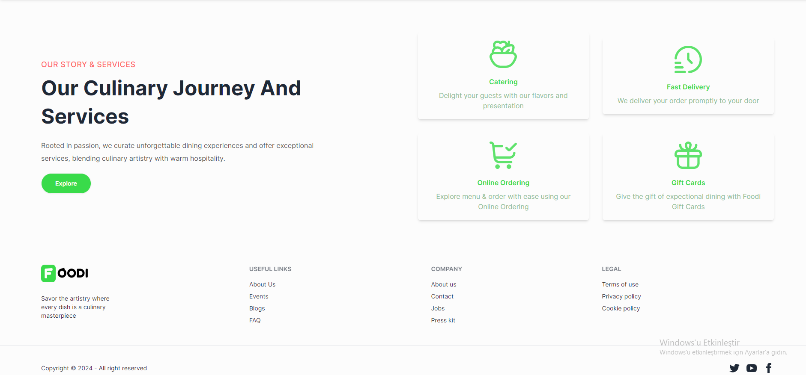

#### Signup Page:

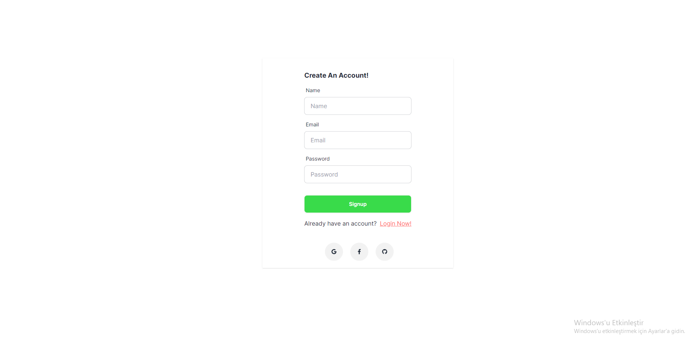

#### Login Page:

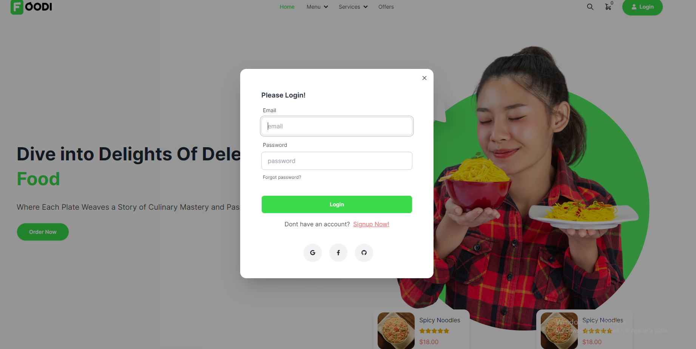

#### Menu Page:

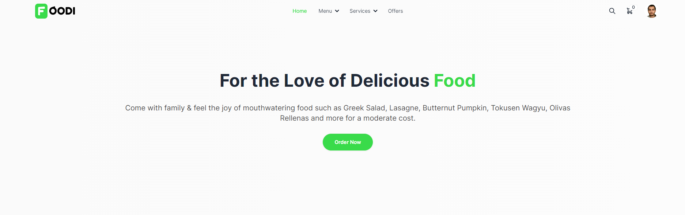
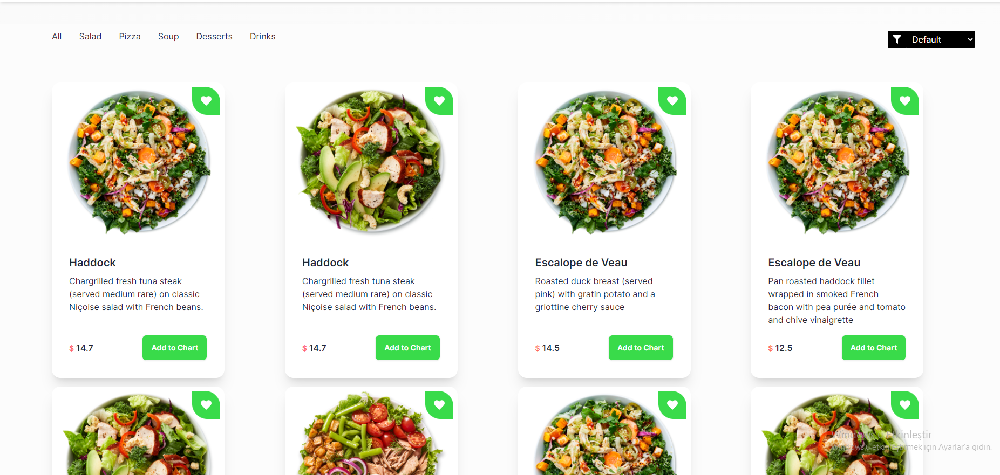
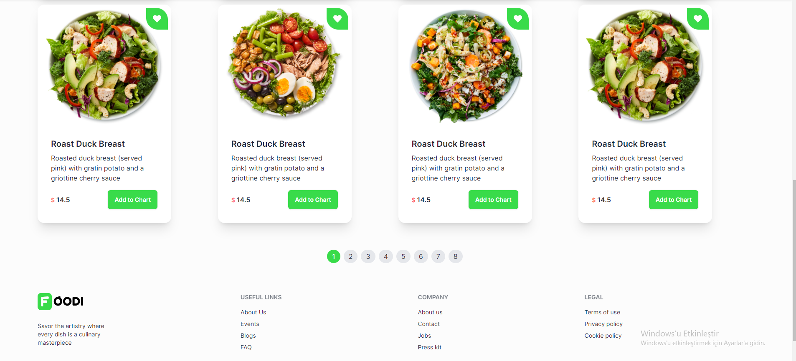

#### Cart Page:

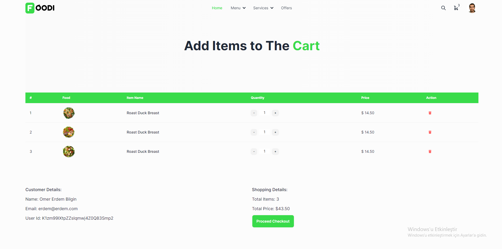

#### Dashboard Page:

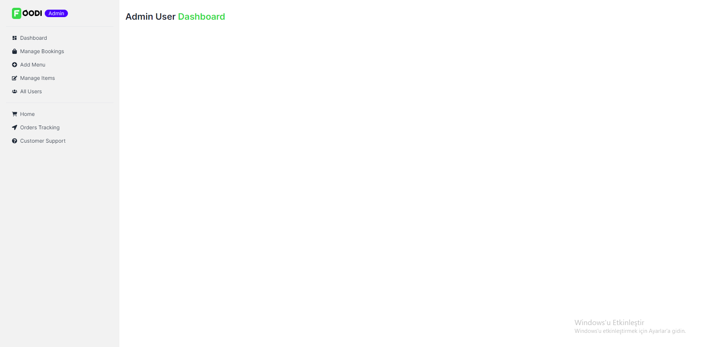

#### Users Page:

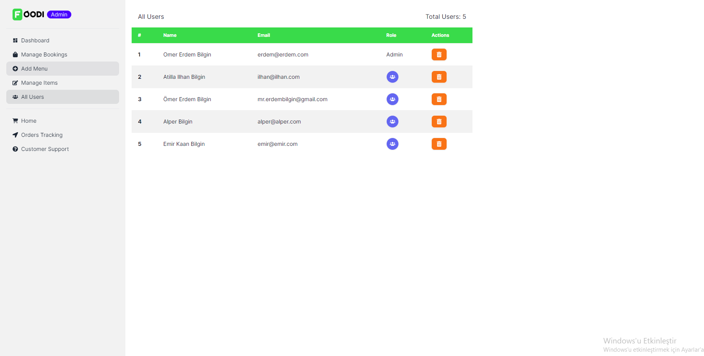

#### Manage Items Page:

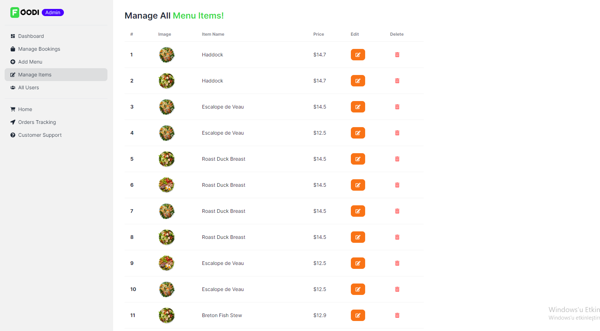

#### Add To Menu Page:

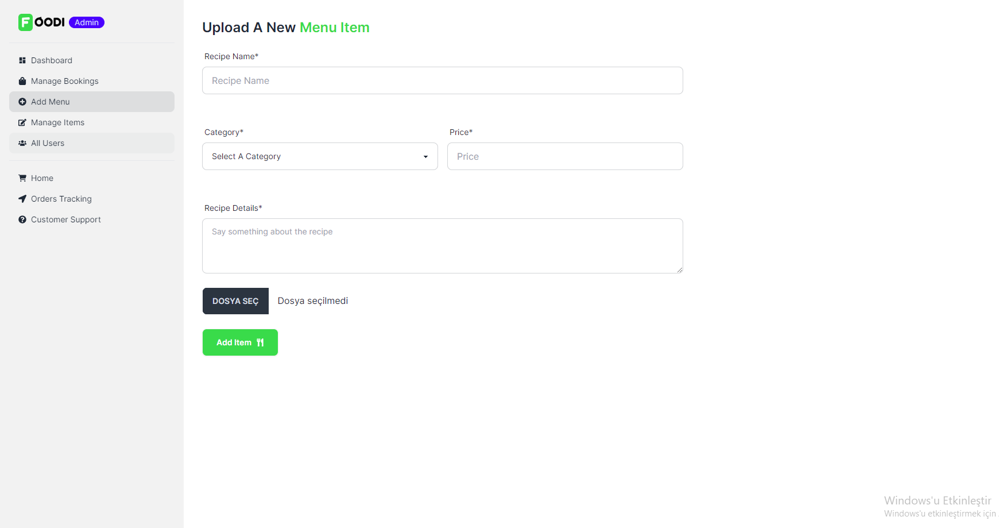

#### Update Profile Page:

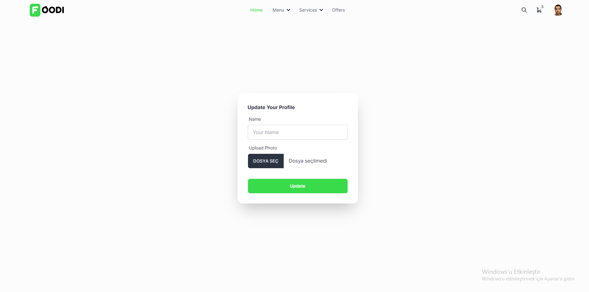

#### Popups

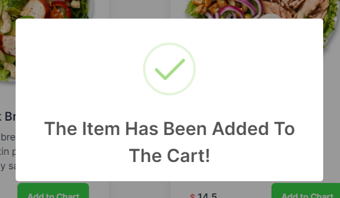

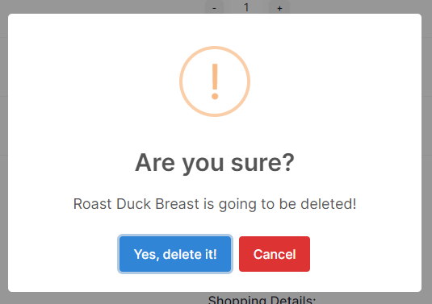

## Backend

The backend of this project is created with ExpressJS. MongoDB is used for the database. <br />
To start the backend: <br />

`cd server`<br />

`npm install`<br />

`npm run dev`<br />

Also .env file has to be created. <br />

.env content :

```
PORT= your port
MONGO_USERNAME= from MongoDB
MONGO_PASSWORD= from MongoDB

ACCESS_TOKEN_SECRET= The Secret Key For Your Access Token
```
